<div align="center">

# 🚀 KubePilot

**企业级 Kubernetes 智能运维管理平台**

[](https://go.dev/)
[](https://react.dev/)
[](https://www.typescriptlang.org/)
[](https://kubernetes.io/)
[](https://www.postgresql.org/)
[](https://redis.io/)
[](LICENSE)

</div>

---

## 📖 简介

KubePilot 是一个功能完整的 Kubernetes 运维管理平台，提供直观的 Web 界面来管理 K8S 集群。支持多集群管理、工作负载管理、AI 智能运维、任务调度、实时终端等功能，帮助企业简化 K8S 运维操作。

## 📸 功能截图

### 仪表盘与集群管理
| 仪表盘 | 集群管理 |
|:------:|:--------:|
| 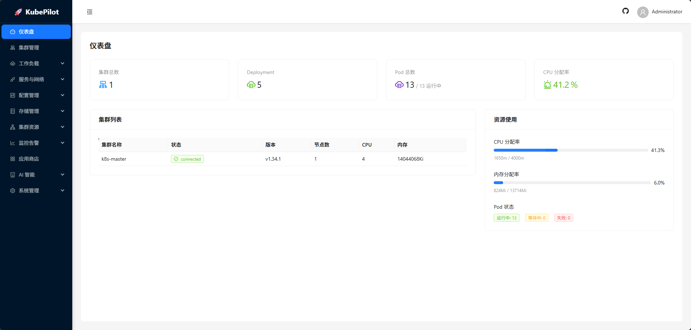 | 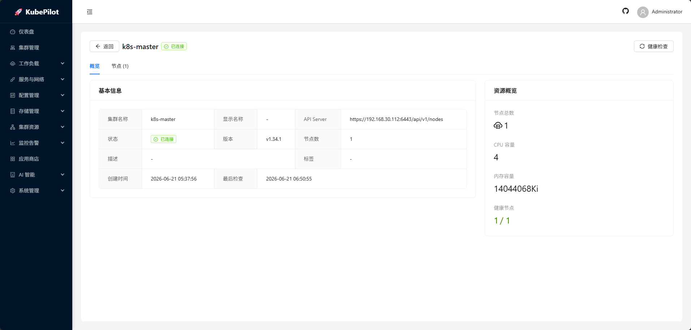 |

### 工作负载管理
| Deployment | Pod 管理 | CRD 管理 |
|:----------:|:--------:|:--------:|
| 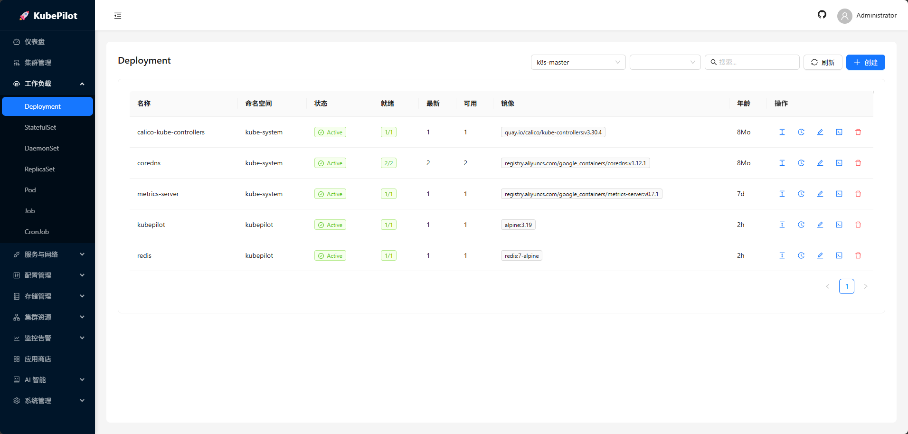 | 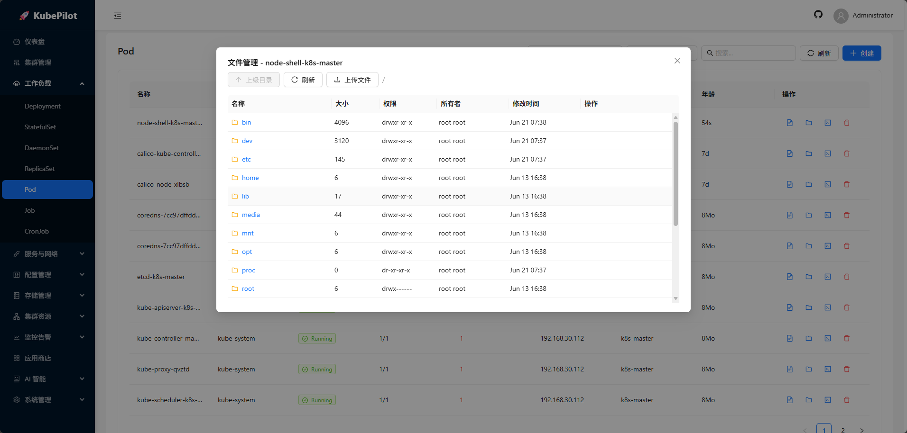 | 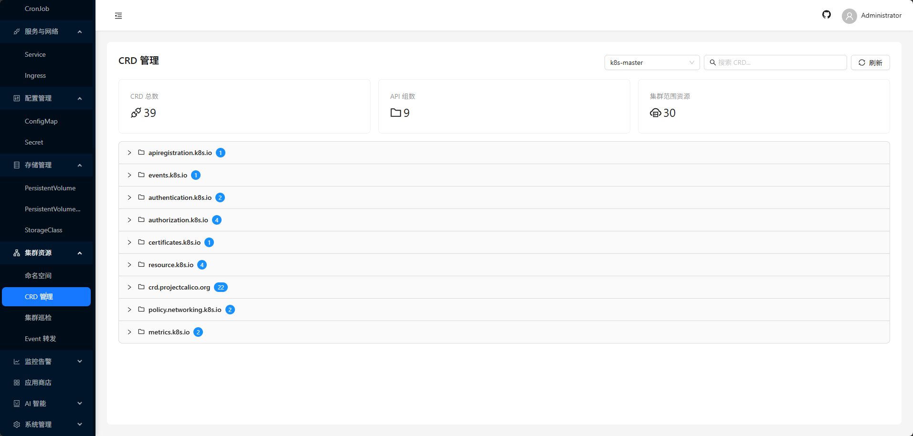 |

### AI 智能运维
| AI 助手 | AI Agent | AI 智能诊断 |
|:-------:|:--------:|:-----------:|
| 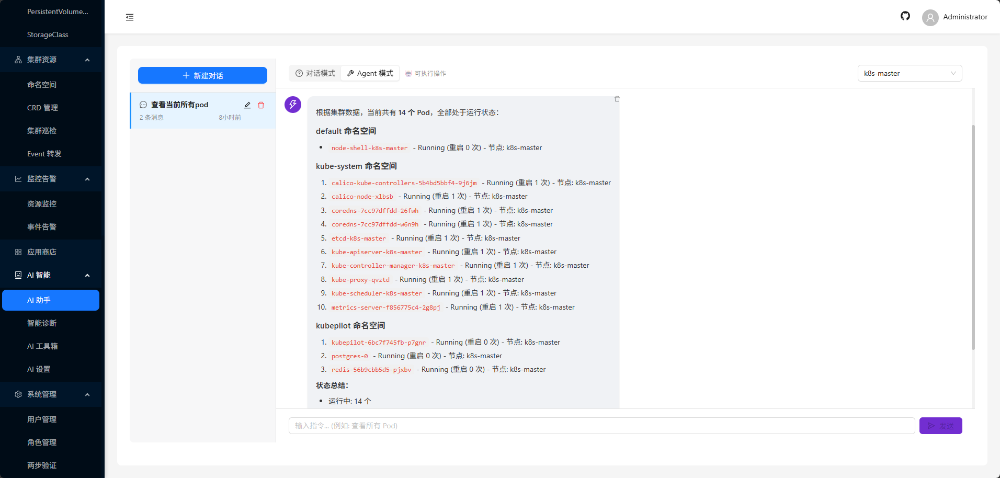 | 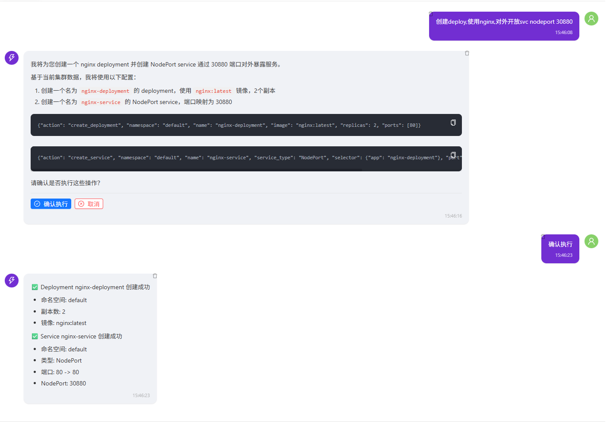 |  |

### 运维工具
| 资源监控 | 资源依赖 | 闲置资源 |
|:--------:|:--------:|:--------:|
| 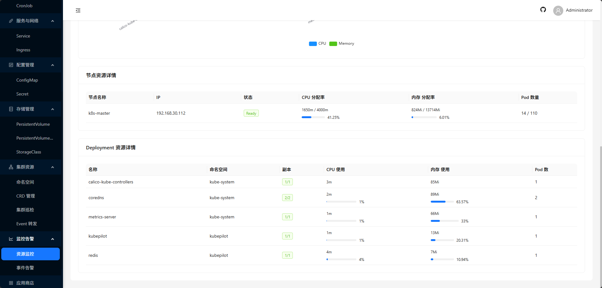 | 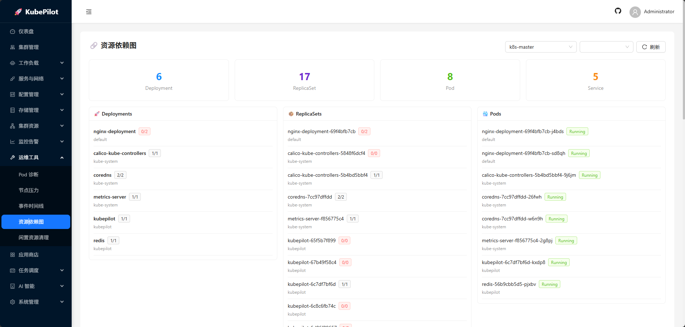 | 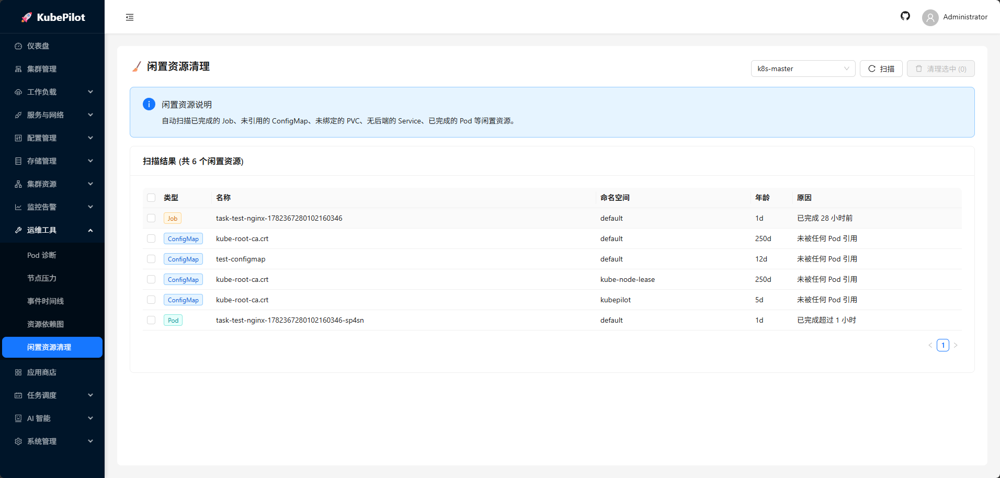 |

### 其他功能
| 资源指南 | 用户权限 | Pod 诊断 |
|:--------:|:--------:|:--------:|
| 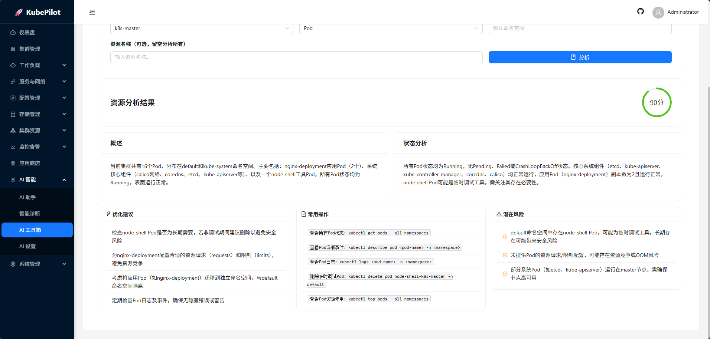 | 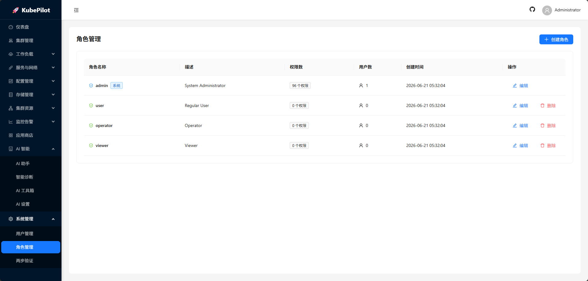 | 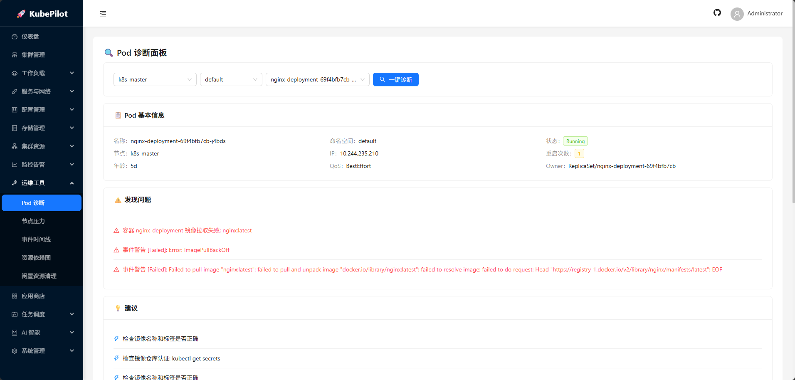 |

## ✨ 核心功能

### 🖥️ 集群管理
- 多集群统一管理，支持编辑和健康检查
- 节点管理（查看详情、cordon/uncordon、taint）
- 命名空间管理（创建、编辑标签、删除）
- YAML 在线编辑器（基于 client-go，无需 kubectl）

### 📦 工作负载
| 资源 | 创建 | 查看 | 编辑 | 删除 |
|------|:----:|:----:|:----:|:----:|
| Deployment | ✅ | ✅ | ✅ | ✅ |
| StatefulSet | ✅ | ✅ | ✅ | ✅ |
| DaemonSet | ✅ | ✅ | ✅ | ✅ |
| ReplicaSet | - | ✅ | ✅ | ✅ |
| Pod | ✅ | ✅ | - | ✅ |
| Job | ✅ | ✅ | - | ✅ |
| CronJob | ✅ | ✅ | ✅ | ✅ |
| Service | ✅ | ✅ | ✅ | ✅ |
| Ingress | ✅ | ✅ | ✅ | ✅ |

### 📋 任务调度引擎
- **队列管理** - 创建多个任务队列，设置资源配额和调度策略
- **任务提交** - 支持基础表单模式和 YAML 模式
- **优先级调度** - 0-1000 级优先级控制
- **资源预留** - 支持时间窗口和周期性预留
- **任务监控** - 实时状态、日志查看、K8S Job 关联
- **YAML 模板** - 预置 Job/CronJob/GPU 训练模板

### 💾 存储管理
- **PersistentVolume** - 创建、编辑、删除
- **PersistentVolumeClaim** - 创建、编辑、删除
- **StorageClass** - 完整 CRUD

### ⚙️ 配置管理
- **ConfigMap** - 完整 CRUD
- **Secret** - 完整 CRUD（数据加密显示）
- **ResourceQuota** - 创建、更新、删除

### 🤖 AI 智能运维
- **AI 对话** - 智能问答，支持流式输出和 Markdown 渲染
- **AI Agent** - 自然语言操作 K8S，支持多任务批量执行
- **智能诊断** - 问题诊断、日志分析、根因定位（自动获取 describe）
- **AI 工具箱**：
  - 划词解释 - 解释 K8S 概念、命令、配置、错误信息
  - 资源指南 - 分析资源状态，给出健康评分和优化建议
  - YAML 翻译 - YAML 配置中英文翻译

### 🔒 安全特性
- JWT 认证 + RBAC 权限控制（16 种资源 × 6 种操作）
- 两步验证 (2FA/TOTP)，支持备份码
- 审计日志（敏感数据自动脱敏）
- WebSocket 连接认证
- CORS 安全配置

### 🔧 运维工具
- **集群巡检** - 自定义规则，定时巡检，生成报告
- **Event 转发** - 转发 K8S 事件到 Webhook，支持过滤
- **SSO/OAuth** - 支持 GitHub、GitLab、Google 等 OAuth2 登录
- **多数据库** - 支持 PostgreSQL、MySQL、SQLite
- **缓存系统** - 支持内存缓存和 Redis

### 📊 监控告警
- 集群资源概览仪表盘
- 节点压力可视化（CPU/内存/Pod）
- 事件时间线（按时间聚合）
- 告警规则管理
- 通知渠道配置

### 🖥️ 终端功能
- Pod 终端 (WebSocket)
- Node Shell (nsenter，支持 Pod 复用)
- 文件管理（浏览、编辑、上传、下载）
- 日志查看（搜索、高亮、下载）

### 📋 批量操作
- Deployment/Pod 支持批量选择
- 批量删除、批量重启
- 批量标签管理

### 🔍 资源管理
- **资源依赖图** - 可视化 Deployment→ReplicaSet→Pod→Service 关系
- **资源对比** - 跨集群资源对比
- **闲置资源清理** - 自动识别已完成 Job、未引用 ConfigMap、未绑定 PVC
- **HPA 管理** - 水平自动伸缩配置

## 🛠️ 技术栈

| 层级 | 技术 |
|------|------|
| **后端** | Go 1.21+, Gin, GORM, client-go |
| **前端** | React 18, TypeScript, Ant Design 5, Zustand |
| **数据库** | PostgreSQL 15, Redis 7 |
| **AI** | OpenAI API, Anthropic API (可扩展) |
| **部署** | Docker, Kubernetes, Helm |

## 🚀 快速开始

### 前置条件

- Go 1.21+
- Node.js 18+
- PostgreSQL 15+ (或 SQLite/MySQL)
- Redis 7+ (可选，支持内存缓存)

### 方式一：Docker Compose（推荐）

```bash
# 克隆项目
git clone https://github.com/Xnidada/KubePilot.git
cd KubePilot

# 修改配置
cp configs/config.example.yaml configs/config.yaml
# 编辑 configs/config.yaml，修改数据库密码和 JWT 密钥

# 启动服务
docker-compose up -d

# 访问
open http://localhost:8080
```

**默认管理员账号**：`admin` / `admin123`（首次登录后请立即修改密码）

### 方式二：Kubernetes

```bash
# 克隆项目
git clone https://github.com/Xnidada/KubePilot.git
cd KubePilot

# 修改配置
vim deploy/k8s/kubepilot.yaml  # 修改 JWT 密钥等配置

# 部署
kubectl apply -f deploy/k8s/namespace.yaml
kubectl apply -f deploy/k8s/postgres.yaml
kubectl apply -f deploy/k8s/redis.yaml
kubectl apply -f deploy/k8s/kubepilot.yaml

# 访问（NodePort 方式，端口 30080）
open http://<NODE_IP>:30080
```

### 方式三：编译安装

```bash
# 克隆项目
git clone https://github.com/Xnidada/KubePilot.git
cd KubePilot

# 配置
cp configs/config.example.yaml configs/config.yaml
vim configs/config.yaml

# 编译后端
go mod tidy
go build -o kubepilot ./cmd/server/

# 编译前端
cd frontend
npm install
npm run build
cd ..

# 初始化管理员
go run scripts/init-admin.go

# 运行
./kubepilot
```

## 📁 项目结构

```
KubePilot/
├── cmd/server/              # 程序入口
├── internal/
│   ├── config/              # 配置管理
│   ├── handler/             # HTTP 处理器
│   │   ├── aiops/           # AI 运维
│   │   ├── alert/           # 告警管理
│   │   ├── auth/            # 认证（含 2FA）
│   │   ├── cluster/         # 集群管理
│   │   ├── scheduler/       # 任务调度
│   │   ├── system/          # 系统管理
│   │   └── workload/        # 工作负载
│   ├── k8s/                 # K8S 客户端
│   ├── llm/                 # LLM 集成
│   ├── middleware/           # 中间件（认证/RBAC/审计/CORS）
│   ├── model/               # 数据模型
│   ├── pkg/                 # 公共包（缓存/加密/日志）
│   ├── repository/          # 数据仓库
│   ├── router/              # 路由（含巡检/Event转发/OAuth/调度）
│   └── service/             # 业务服务
├── frontend/                # 前端项目
│   └── src/
│       ├── api/             # API 调用
│       ├── components/      # 组件（Markdown/终端/文件管理）
│       ├── hooks/           # Hooks（会话管理）
│       ├── pages/           # 页面
│       └── stores/          # 状态管理
├── configs/                 # 配置文件
├── deploy/                  # 部署配置
│   ├── k8s/                 # K8S YAML
│   └── helm/                # Helm Chart
├── images/                  # 项目截图
├── scripts/                 # 脚本工具
├── docker-compose.yml       # Docker Compose
└── Dockerfile               # Docker 镜像
```

## ⚙️ 配置说明

### 配置文件

```yaml
server:
  host: "0.0.0.0"
  port: 8080
  mode: "release"  # debug, release, test

database:
  driver: "postgres"  # postgres, mysql, sqlite
  host: "localhost"
  port: 5432
  username: "kubepilot"
  password: "YOUR_PASSWORD"
  dbname: "kubepilot"
  sslmode: "disable"

cache:
  type: "redis"  # memory, redis
  addr: "localhost:6379"
  password: ""
  db: 0

jwt:
  secret: "YOUR_JWT_SECRET"  # 必须修改！
  expire_time: 24h
  issuer: "kubepilot"

log:
  level: "info"   # debug, info, warn, error
  format: "json"  # json, console
  output: "stdout"

k8s:
  default_namespace: "default"
  qps: 50.0
  burst: 100
```

### 环境变量

所有配置都支持环境变量覆盖，前缀为 `KUBEPILOT_`：

```bash
KUBEPILOT_DATABASE_HOST=localhost
KUBEPILOT_DATABASE_PORT=5432
KUBEPILOT_DATABASE_PASSWORD=your_password
KUBEPILOT_JWT_SECRET=your_jwt_secret
```

## 📡 API 概览

### 认证
```
POST   /api/v1/auth/login          # 登录
POST   /api/v1/auth/register       # 注册
POST   /api/v1/auth/2fa/verify     # 2FA 验证
```

### 集群管理
```
GET    /api/v1/clusters            # 集群列表
POST   /api/v1/clusters            # 添加集群
PUT    /api/v1/clusters/:id        # 更新集群
DELETE /api/v1/clusters/:id        # 删除集群
POST   /api/v1/clusters/:id/health # 健康检查
```

### 任务调度
```
GET    /api/v1/scheduler/queues    # 队列列表
POST   /api/v1/scheduler/queues    # 创建队列
GET    /api/v1/scheduler/tasks     # 任务列表
POST   /api/v1/scheduler/tasks     # 提交任务
POST   /api/v1/scheduler/tasks/:id/cancel  # 取消任务
POST   /api/v1/scheduler/tasks/:id/retry   # 重试任务
GET    /api/v1/scheduler/tasks/:id/logs    # 任务日志
```

### AI 运维
```
POST   /api/v1/aiops/chat           # AI 对话
POST   /api/v1/aiops/chat/stream    # 流式对话
POST   /api/v1/aiops/agent          # AI Agent
POST   /api/v1/aiops/diagnose       # 智能诊断
POST   /api/v1/aiops/explain        # 划词解释
POST   /api/v1/aiops/resource-guide # 资源指南
POST   /api/v1/aiops/translate-yaml # YAML 翻译
POST   /api/v1/aiops/analyze-logs   # 日志问诊
```

### 运维工具
```
GET    /api/v1/ops/:id/diagnose/pod/:ns/:name  # Pod 诊断
GET    /api/v1/ops/:id/nodes/pressure           # 节点压力
GET    /api/v1/ops/:id/events/timeline          # 事件时间线
GET    /api/v1/ops/:id/resource-graph           # 资源依赖图
GET    /api/v1/ops/:id/rbac                     # RBAC 可视化
GET    /api/v1/ops/:id/idle-resources           # 闲置资源
```

### 巡检与事件
```
GET    /api/v1/inspection/rules     # 巡检规则
POST   /api/v1/inspection/rules/:id/run  # 执行巡检
GET    /api/v1/event-forward/rules  # 转发规则
POST   /api/v1/event-forward/rules/:id/test # 测试转发
```

## 🔐 权限说明

### 预定义角色

| 角色 | 说明 | 权限 |
|------|------|------|
| admin | 系统管理员 | 全部权限 |
| operator | 运维人员 | 管理工作负载、告警、任务调度 |
| user | 开发人员 | 查看、创建工作负载 |
| viewer | 只读用户 | 仅查看 |

### 资源类型

clusters, deployments, pods, services, configmaps, secrets, pvcs, pvs, namespaces, nodes, events, alerts, users, roles, audit_logs, scheduler

## 🏗️ 架构设计

```
┌─────────────────────────────────────────────────────────────────┐
│                        KubePilot 架构                           │
├─────────────────────────────────────────────────────────────────┤
│                                                                  │
│  ┌─────────────────────────────────────────────────────────┐   │
│  │                    前端 (React + TypeScript)             │   │
│  │  集群管理 | 工作负载 | 任务调度 | AI 运维 | 监控告警    │   │
│  └─────────────────────────────────────────────────────────┘   │
│                              │                                   │
│  ┌─────────────────────────────────────────────────────────┐   │
│  │                    后端 (Go + Gin)                       │   │
│  │  JWT认证 → RBAC权限 → 业务处理 → K8S API               │   │
│  └─────────────────────────────────────────────────────────┘   │
│                              │                                   │
│  ┌─────────────────────────────────────────────────────────┐   │
│  │                    数据层                                │   │
│  │  PostgreSQL (持久化) | Redis (缓存) | K8S API (资源)    │   │
│  └─────────────────────────────────────────────────────────┘   │
│                                                                  │
└─────────────────────────────────────────────────────────────────┘
```

## 🔧 运维建议

1. **修改默认密码** - 首次登录后立即修改 admin 密码
2. **修改 JWT 密钥** - 使用强随机字符串，不要使用默认值
3. **启用 HTTPS** - 配置 Ingress TLS 或反向代理
4. **定期备份** - 备份 PostgreSQL 数据
5. **配置监控** - 接入 Prometheus + Grafana
6. **限制访问** - 配置网络策略限制 API 访问

## 🤝 贡献

欢迎提交 Issue 和 Pull Request！

1. Fork 本仓库
2. 创建功能分支 (`git checkout -b feature/AmazingFeature`)
3. 提交更改 (`git commit -m 'Add some AmazingFeature'`)
4. 推送到分支 (`git push origin feature/AmazingFeature`)
5. 创建 Pull Request

## 📄 许可证

本项目采用 [Apache License 2.0](LICENSE) 许可证。

## 🙏 致谢

- [Kubernetes](https://kubernetes.io/)
- [Gin](https://github.com/gin-gonic/gin)
- [Ant Design](https://ant.design/)
- [React](https://react.dev/)
- [GORM](https://gorm.io/)

---

<div align="center">

**如果觉得不错，请给个 ⭐ Star 支持一下！**

</div>
