<div align="center">

# 🚀 KubePilot

**企业级 Kubernetes 智能运维管理平台**

[](https://go.dev/)
[](https://react.dev/)
[](https://www.typescriptlang.org/)
[](https://kubernetes.io/)
[](https://www.postgresql.org/)
[](https://redis.io/)
[](LICENSE)

</div>

---

## 📖 简介

KubePilot 是一个企业级 Kubernetes 智能运维管理平台：多集群统一管理、工作负载全生命周期、进程内可启停功能模块、AI Agent（原生 Tool Calling + 写操作确认）、备份/SSO/巡检/Event 转发等能力，帮助团队在同一套界面完成日常运维。

默认演示账号（首次登录后请改密）：

| 账号 | 密码 | 角色 |
|------|------|------|
| `admin` | `admin123` | 管理员 |
| `aiviewer` | `admin123` | AI 只读（可浏览 AI/他人 Agent 对话，不可执行写操作） |
| `viewer` | `admin123` | 只读（不含 AI 智能） |

## 📸 功能截图

### 概览与集群

| 仪表盘 | 集群管理 | 资源监控 |
|:------:|:--------:|:--------:|
| 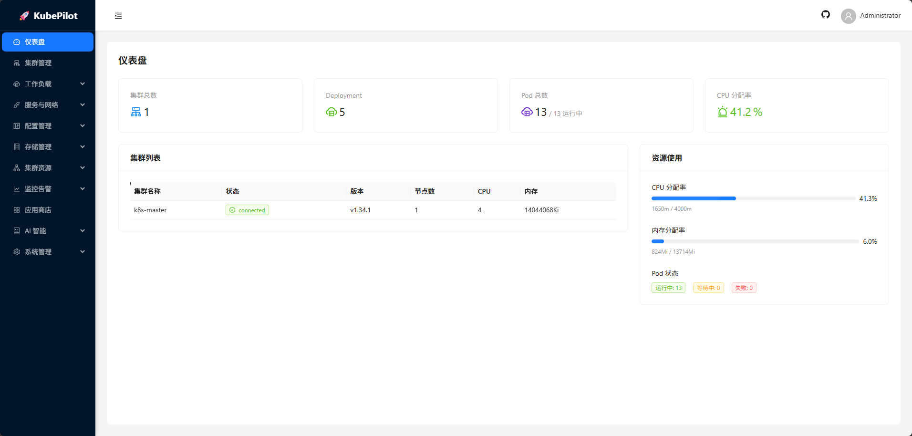 | 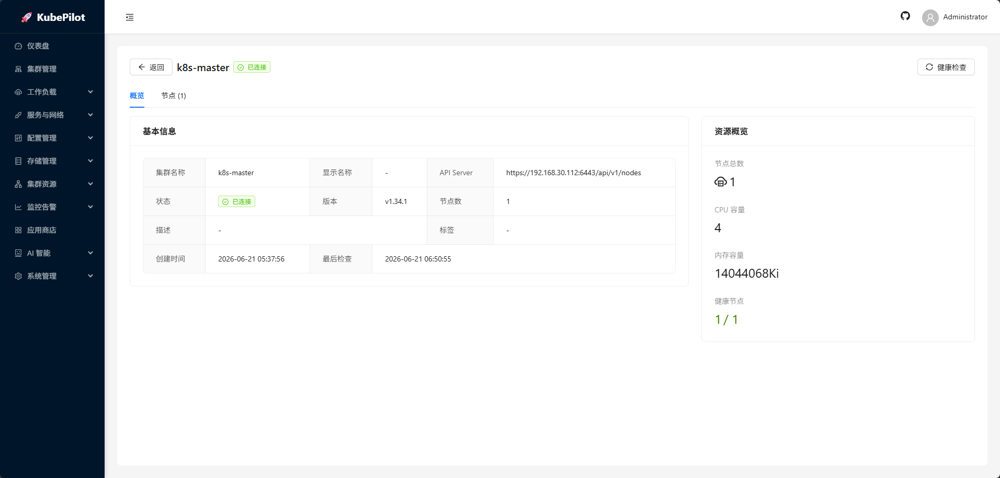 | 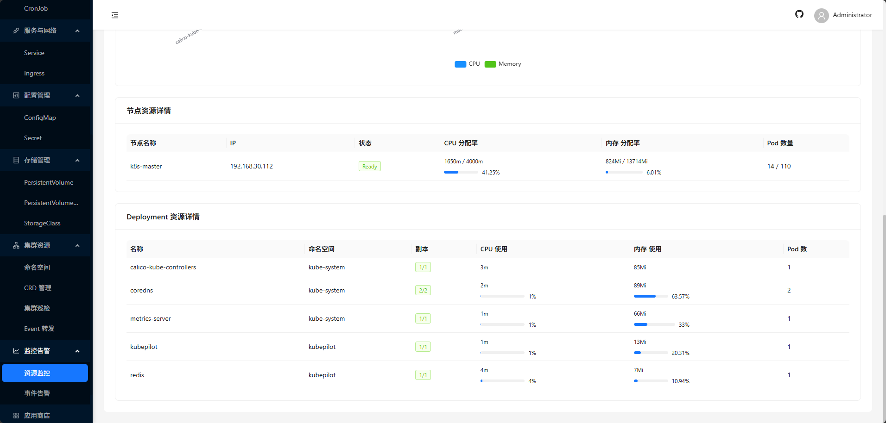 |

### 工作负载与网络

| Deployment | 创建 Deployment | Pod |
|:----------:|:--------------:|:---:|
| 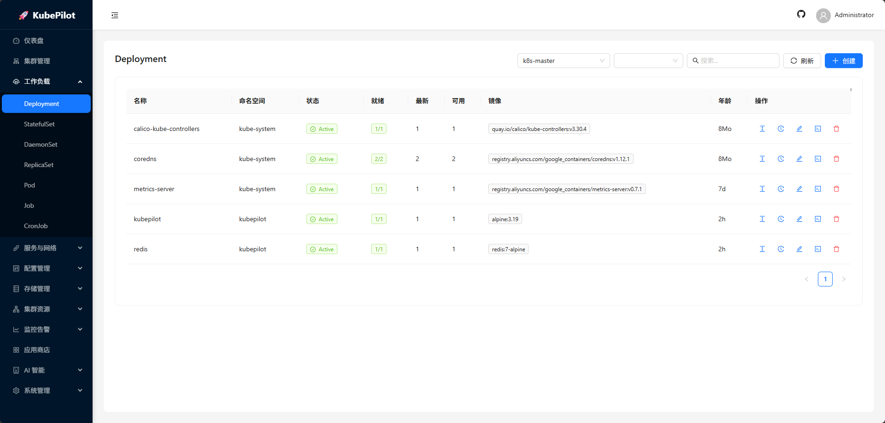 |  | 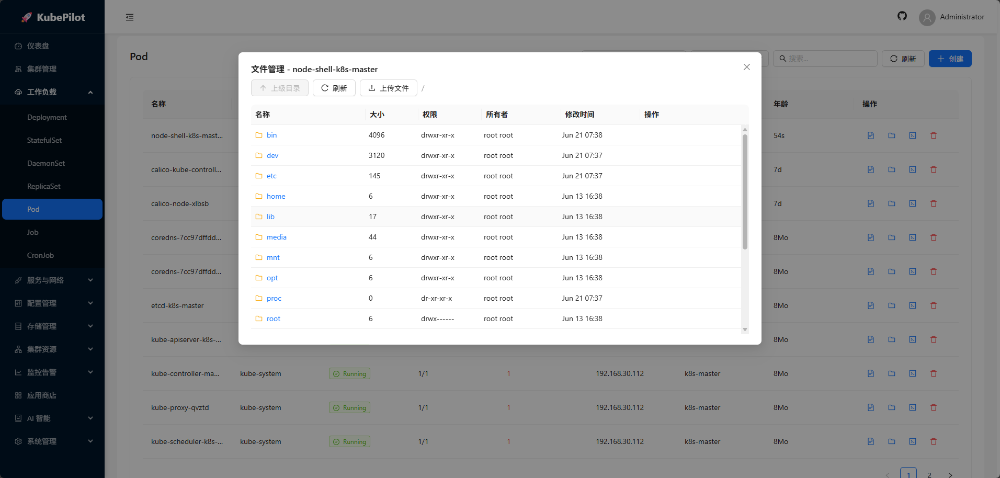 |

| Service | HPA | CRD |
|:-------:|:---:|:---:|
| 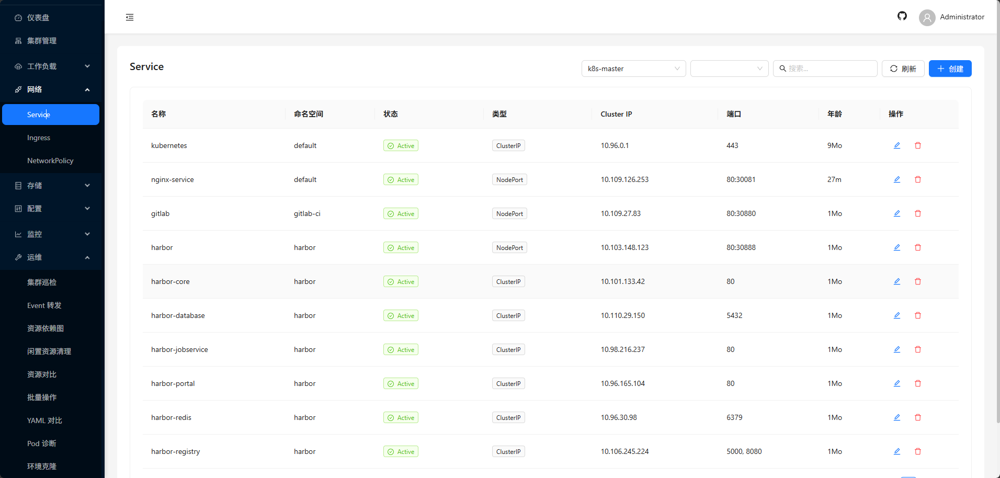 | 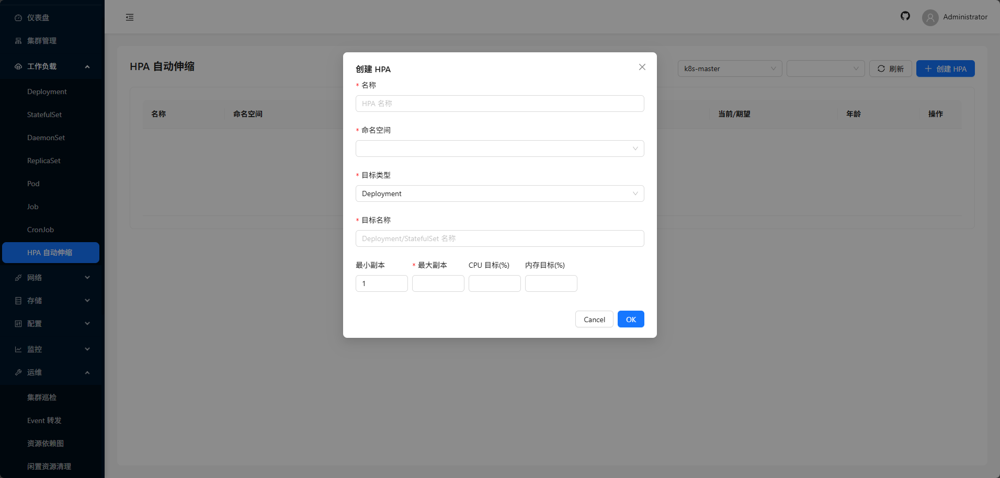 | 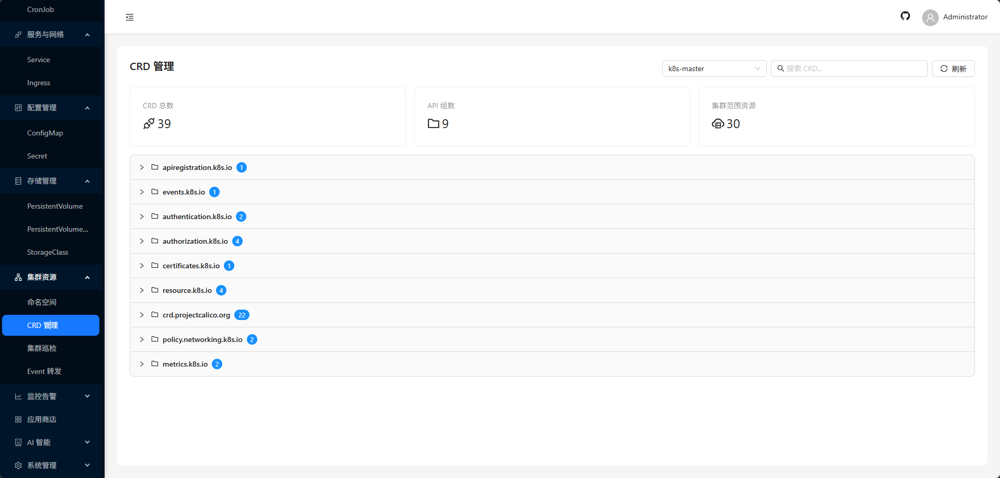 |

### 存储与成本

| PersistentVolume | 资源成本分析 |
|:----------------:|:------------:|
| 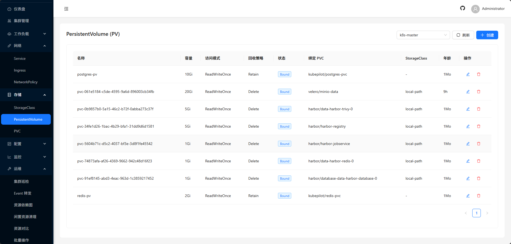 | 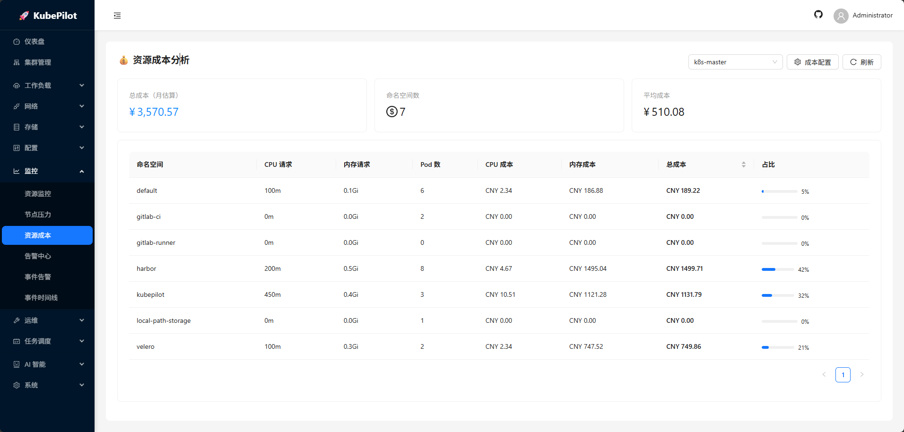 |

### AI 智能

| AI Agent | AI 智能诊断 | 智能诊断 |
|:--------:|:-----------:|:--------:|
| 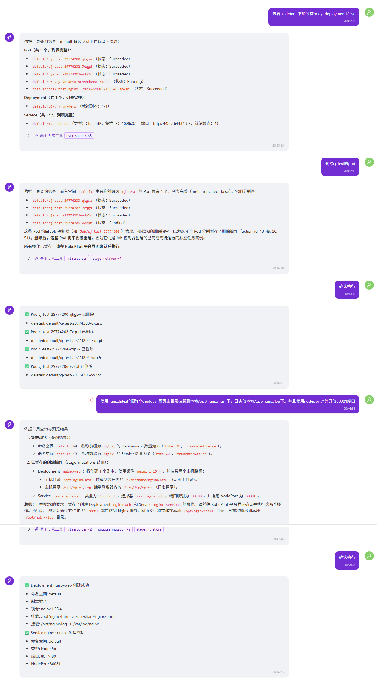 |  | 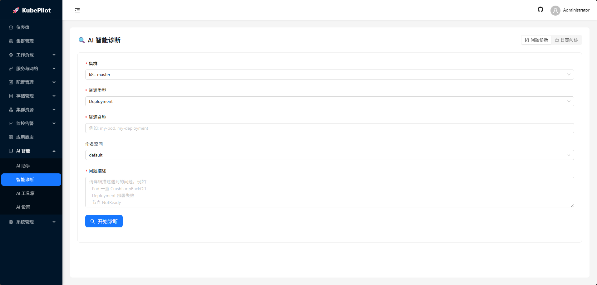 |

| 日志问诊 | 资源指南 | 资源状态诊断 |
|:--------:|:--------:|:------------:|
| 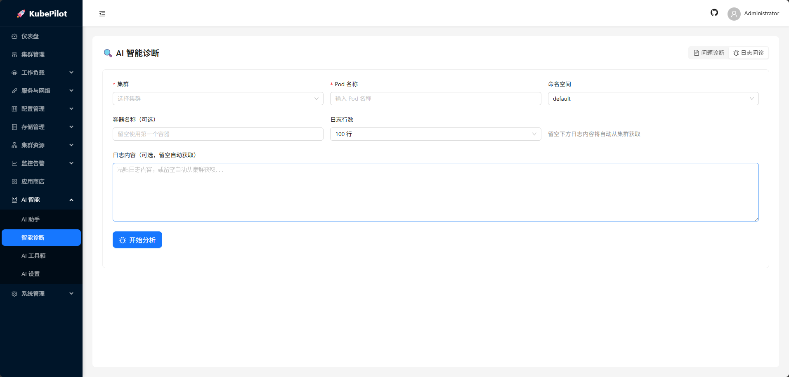 | 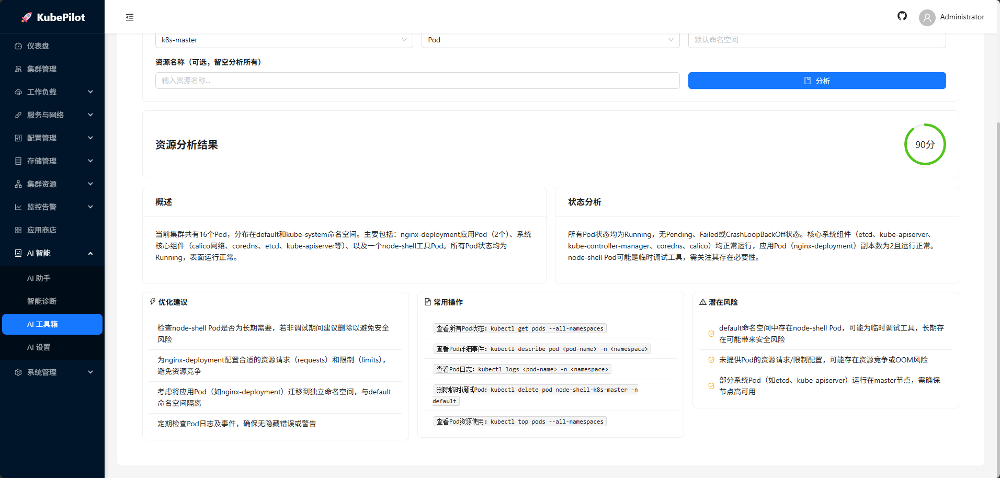 | 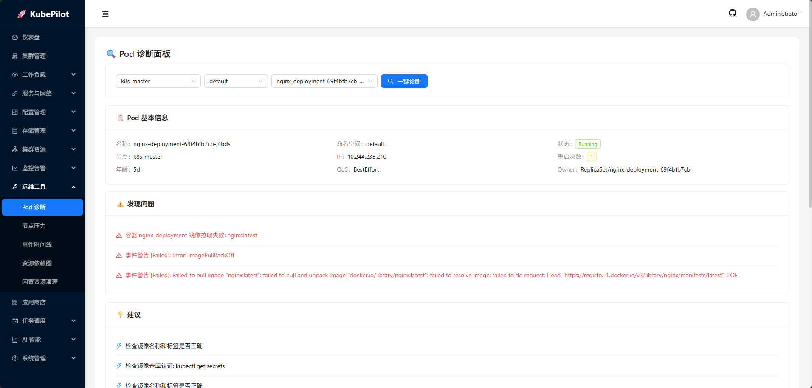 |

### 运维与系统

| 资源依赖图 | 闲置资源检测 | 用户权限 |
|:----------:|:------------:|:--------:|
| 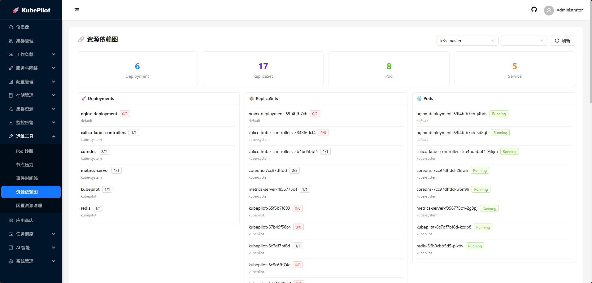 | 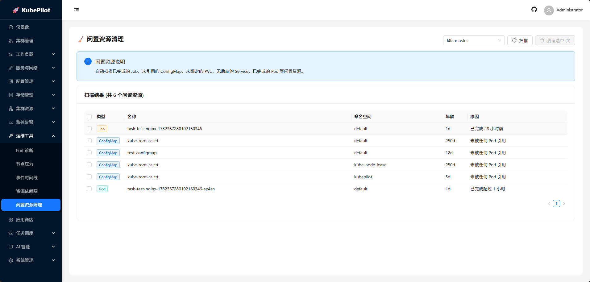 | 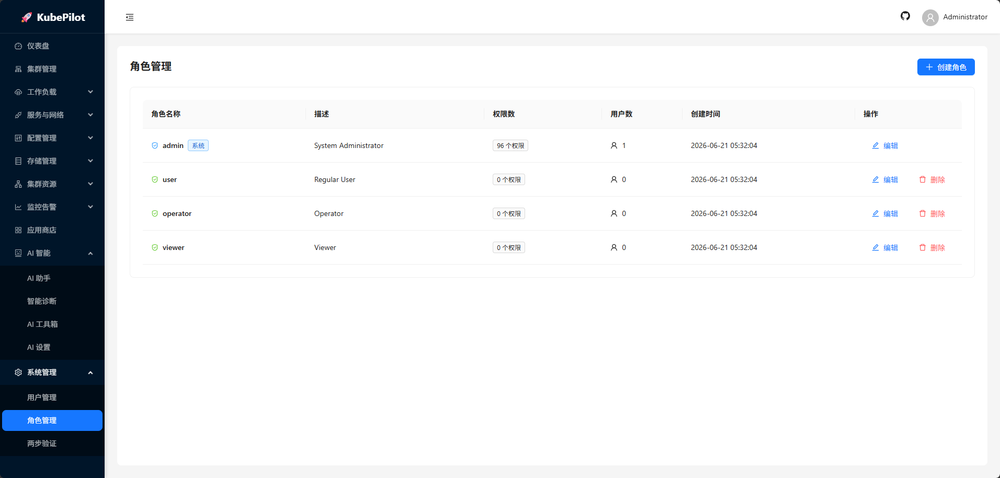 |

| 备份管理 | Webhook 通知 |
|:--------:|:------------:|
| 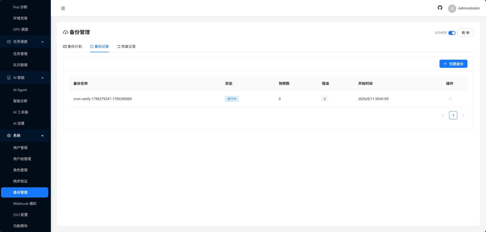 |  |

## ✨ 核心功能

### 🖥️ 集群管理
- 多集群统一管理，支持编辑和健康检查
- 节点管理（查看详情、cordon/uncordon、taint）
- 命名空间管理（创建、编辑标签、删除）
- YAML 在线编辑器（基于 client-go，无需 kubectl）

### 📦 工作负载
| 资源 | 创建 | 查看 | 编辑 | 删除 |
|------|:----:|:----:|:----:|:----:|
| Deployment | ✅ | ✅ | ✅ | ✅ |
| StatefulSet | ✅ | ✅ | ✅ | ✅ |
| DaemonSet | ✅ | ✅ | ✅ | ✅ |
| ReplicaSet | - | ✅ | ✅ | ✅ |
| Pod | ✅ | ✅ | - | ✅ |
| Job | - | ✅ | - | ✅ |
| CronJob | ✅ | ✅ | ✅ | ✅ |
| HPA | ✅ | ✅ | ✅ | ✅ |
| Service | ✅ | ✅ | ✅ | ✅ |
| Ingress | ✅ | ✅ | ✅ | ✅ |
| CRD / 自定义资源 | - | ✅ | - | - |

**页面内能力**：工作负载列表支持批量删除/重启；Deployment/Pod 详情支持 YAML 编辑与对比；诊断能力集成在 AI「智能诊断」与资源详情中（不再提供独立运维子菜单）。

**CronJob 特色功能**：
- 可视化调度配置（每N分钟/每N小时/每天/每周/每月）
- 图形化编辑（支持修改 Command/Args）
- YAML 编辑模式
- 暂停/恢复调度
- 批量操作（批量暂停/恢复/删除）

**Job 说明**：Job 页面为只读视图，创建任务请使用「任务调度」功能。

### 📋 任务调度引擎
- **队列管理** - 创建多个任务队列，设置资源配额和调度策略
- **任务提交** - 支持基础表单模式和 YAML 模式
- **优先级调度** - 0-1000 级优先级控制
- **资源预留** - 支持时间窗口和周期性预留
- **任务监控** - 实时状态、日志查看、K8S Job 关联
- **批量操作** - 支持批量删除任务
- **YAML 模板** - 预置 Job 和 GPU 训练模板

### 💾 存储管理
- **PersistentVolume** - 创建、编辑、删除
- **PersistentVolumeClaim** - 创建、编辑、删除
- **StorageClass** - 完整 CRUD

### ⚙️ 配置管理
- **ConfigMap** - 完整 CRUD
- **Secret** - 完整 CRUD（数据加密显示）
- **ResourceQuota** - 创建、更新、删除
- **NetworkPolicy** - 创建、查看、删除

### 🤖 AI 智能运维
- **AI Agent**（原生 Tool Calling）
  - 读操作：list/get/describe/events/logs、Service/工作负载诊断
  - 写操作：`stage_mutation` 暂存 → UI 确认后执行（支持 NodePort、hostPath 挂载等）
  - `aiviewer` 可浏览全部用户 Agent 对话（只读）
- **智能诊断** - 问题诊断（自动获取 describe）、日志分析、资源状态建议
- **AI 工具箱**：
  - 划词解释 - 解释 K8S 概念、命令、配置、错误信息
  - 资源指南 - 分析资源状态，给出健康评分和优化建议
  - YAML 翻译 - YAML 配置中英文翻译
  - 日志问诊 - 粘贴或拉取日志后给出排查建议

### 🔒 安全特性
- JWT 认证 + 平台 RBAC 与集群/命名空间授权 fail-closed（角色决定「能做什么」，集群授权决定「在哪做」）
- 用户组与有效权限预览
- 两步验证 (2FA/TOTP)，支持备份码
- SSO/OAuth2（GitHub、GitLab、Google 等）
- 审计日志（敏感数据自动脱敏）
- WebSocket 连接认证；Webhook/告警出站 SSRF 校验

### 🔧 运维与系统模块
进程内模块可启停，统一暴露健康状态与菜单（系统 → 模块）：
- **集群巡检** - 自定义规则，定时巡检，生成报告
- **Event 转发** - 转发 K8S 事件到 Webhook，支持过滤与健康迟滞
- **备份管理（Velero）** - 真实 `velero.io/v1` Backup/Restore；未安装 Velero 时拒绝假成功
- **Webhook 通知** - 平台事件通知渠道
- **任务调度 / AIOps / AppStore** - 对应功能模块
- **环境克隆 / GPU 调度 / 资源依赖图 / 闲置资源清理**

### 📊 监控告警
- 集群资源概览仪表盘
- 节点压力可视化（CPU/内存/Pod）
- 资源成本分析（支持自定义单价）
- 事件时间线（按时间聚合）
- 告警规则管理（含评估失败可见）
- 通知渠道配置

### 🖥️ 终端功能
- Pod 终端 (WebSocket)
- Node Shell (nsenter，支持 Pod 复用)
- 文件管理（浏览、编辑、上传、下载）
- 日志查看（搜索、高亮、下载）

## 🛠️ 技术栈

| 层级 | 技术 |
|------|------|
| **后端** | Go 1.26+, Gin, GORM, client-go |
| **前端** | React 18, TypeScript, Ant Design 5, Zustand |
| **数据库** | PostgreSQL 15, Redis 7 |
| **AI** | OpenAI API, Anthropic API (可扩展) |
| **部署** | Docker, Kubernetes, Helm |

## 🚀 快速开始

### 前置条件

- Go 1.26+
- Node.js 18+
- PostgreSQL 15+
- Redis 7+ (可选，支持内存缓存)

### 方式一：Docker Compose（推荐）

```bash
# 克隆项目
git clone https://github.com/Xnidada/KubePilot.git
cd KubePilot

# 修改配置
cp configs/config.example.yaml configs/config.yaml
# 编辑 configs/config.yaml，修改数据库密码和 JWT 密钥

# 启动服务
docker-compose up -d

# 访问
open http://localhost:8080
```

**默认管理员账号**：`admin` / `admin123`（首次登录后请立即修改密码）

### 方式二：Kubernetes

```bash
# 克隆项目
git clone https://github.com/Xnidada/KubePilot.git
cd KubePilot

# 修改配置
vim deploy/k8s/kubepilot.yaml  # 修改 JWT 密钥等配置

# 部署
kubectl apply -f deploy/k8s/namespace.yaml
kubectl apply -f deploy/k8s/postgres.yaml
kubectl apply -f deploy/k8s/redis.yaml
kubectl apply -f deploy/k8s/kubepilot.yaml

# 访问（NodePort 方式，端口 30080）
open http://<NODE_IP>:30080
```

### 方式三：编译安装

```bash
# 克隆项目
git clone https://github.com/Xnidada/KubePilot.git
cd KubePilot

# 配置
cp configs/config.example.yaml configs/config.yaml
vim configs/config.yaml

# 编译后端
go mod tidy
go build -o kubepilot ./cmd/server/

# 编译前端
cd frontend
npm install
npm run build
cd ..

# 初始化管理员
go run scripts/init-admin.go

# 运行
./kubepilot
```

## 💾 备份（Velero）

KubePilot「系统 → 备份管理」依赖目标集群中的 **Velero**。未安装 CRD 时，创建备份/恢复会被拒绝（避免虚假成功）。

仓库提供开发/单机安装模板（MinIO + Velero Helm）：

```bash
chmod +x deploy/velero/install.sh
./deploy/velero/install.sh install   # 安装
./deploy/velero/install.sh verify    # 校验 CRD / BSL
./deploy/velero/install.sh uninstall # 卸载
```

详细说明见 [`deploy/velero/README.md`](deploy/velero/README.md)。生产环境请将 MinIO 替换为真实对象存储，并修改 `deploy/velero/values-minio.yaml`。

## 📁 项目结构

```
KubePilot/
├── cmd/server/              # 程序入口
├── internal/
│   ├── authz/               # 显式 PolicyRegistry / Authorizer
│   ├── config/              # 配置管理
│   ├── handler/             # HTTP 处理器（aiops/alert/auth/cluster/ops/...）
│   ├── k8s/                 # K8S 客户端
│   ├── llm/                 # LLM 集成（Tool Calling）
│   ├── middleware/          # 认证 / RBAC / 审计 / CORS
│   ├── model/               # 数据模型与种子角色（含 aiviewer）
│   ├── module/              # 进程内模块框架
│   ├── modules/             # aiops / backup / inspection / eventforward / ...
│   ├── pkg/                 # 公共包（缓存/加密/日志）
│   ├── repository/          # 数据仓库
│   ├── router/              # 路由与策略注册
│   └── service/             # 业务服务
├── frontend/                # 前端项目
│   └── src/
│       ├── api/             # API 调用
│       ├── components/      # 组件（终端/YAML/只读横幅等）
│       ├── hooks/           # Hooks（会话管理）
│       ├── pages/           # 页面
│       └── stores/          # 状态管理
├── configs/                 # 配置文件
├── deploy/                  # 部署配置
│   ├── k8s/                 # K8S YAML
│   ├── helm/                # Helm Chart
│   └── velero/              # Velero + MinIO 安装模板（备份依赖）
├── images/                  # README 功能截图（00–21）
├── scripts/                 # 脚本工具
├── docker-compose.yml       # Docker Compose
└── Dockerfile               # Docker 镜像
```

## ⚙️ 配置说明

### 配置文件

```yaml
server:
  host: "0.0.0.0"
  port: 8080
  mode: "release"  # debug, release, test

database:
  driver: "postgres"  # 当前仅支持 PostgreSQL
  host: "localhost"
  port: 5432
  username: "kubepilot"
  password: "YOUR_PASSWORD"
  dbname: "kubepilot"
  sslmode: "disable"

cache:
  type: "redis"  # memory, redis
  addr: "localhost:6379"
  password: ""
  db: 0

jwt:
  secret: "YOUR_JWT_SECRET"  # 必须修改！
  expire_time: 24h
  issuer: "kubepilot"

log:
  level: "info"   # debug, info, warn, error
  format: "json"  # json, console
  output: "stdout"

k8s:
  default_namespace: "default"
  qps: 50.0
  burst: 100
```

### 环境变量

所有配置都支持环境变量覆盖，前缀为 `KUBEPILOT_`：

```bash
KUBEPILOT_DATABASE_HOST=localhost
KUBEPILOT_DATABASE_PORT=5432
KUBEPILOT_DATABASE_PASSWORD=your_password
KUBEPILOT_JWT_SECRET=your_jwt_secret
```

## 📡 API 概览

### 认证
```
POST   /api/v1/auth/login          # 登录
POST   /api/v1/auth/register       # 注册
POST   /api/v1/auth/2fa/verify     # 2FA 验证
```

### 集群管理
```
GET    /api/v1/clusters            # 集群列表
POST   /api/v1/clusters            # 添加集群
PUT    /api/v1/clusters/:id        # 更新集群
DELETE /api/v1/clusters/:id        # 删除集群
POST   /api/v1/clusters/:id/health # 健康检查
```

### 任务调度
```
GET    /api/v1/scheduler/queues    # 队列列表
POST   /api/v1/scheduler/queues    # 创建队列
GET    /api/v1/scheduler/tasks     # 任务列表
POST   /api/v1/scheduler/tasks     # 提交任务
DELETE /api/v1/scheduler/tasks/:id # 删除任务
POST   /api/v1/scheduler/tasks/:id/cancel  # 取消任务
POST   /api/v1/scheduler/tasks/:id/retry   # 重试任务
```

### AI 运维
```
POST   /api/v1/aiops/agent                 # AI Agent（流式见 /agent/stream）
POST   /api/v1/aiops/agent/confirm/:id     # 确认暂存写操作
GET    /api/v1/aiops/conversations         # 对话列表（aiviewer 可见全部）
POST   /api/v1/aiops/diagnose              # 智能诊断
POST   /api/v1/aiops/explain               # 划词解释
POST   /api/v1/aiops/resource-guide        # 资源指南
POST   /api/v1/aiops/translate-yaml        # YAML 翻译
POST   /api/v1/aiops/analyze-logs          # 日志问诊
```

### 运维工具
```
GET    /api/v1/ops/:id/nodes/pressure           # 节点压力
GET    /api/v1/ops/:id/events/timeline          # 事件时间线
GET    /api/v1/ops/:id/resource-graph           # 资源依赖图
GET    /api/v1/ops/:id/rbac                     # RBAC 可视化
GET    /api/v1/ops/:id/idle-resources           # 闲置资源
GET    /api/v1/modules                          # 功能模块健康与详情
```

### 巡检与事件
```
GET    /api/v1/inspection/rules     # 巡检规则
POST   /api/v1/inspection/rules/:id/run  # 执行巡检
GET    /api/v1/event-forward/rules  # 转发规则
POST   /api/v1/event-forward/rules/:id/test # 测试转发
```

## 🔐 权限说明

### 预定义角色

| 角色 | 说明 | 权限 |
|------|------|------|
| admin | 系统管理员 | 全部权限 |
| operator | 运维人员 | 管理工作负载、告警、任务调度 |
| user | 开发人员 | 查看、创建工作负载 |
| viewer | 只读用户 | 仅查看（不含 AI 智能） |
| aiviewer | AI 只读用户 | viewer + 可浏览 AI 智能全部页面与他人 Agent 对话（不可 execute） |

> 非 admin 账号还需在「用户 → 集群权限」中授权集群，否则集群列表为空。种子数据会为 `viewer` / `aiviewer` 等演示账号自动补齐已有集群的只读/读写授权。

### 资源类型（节选）

clusters, deployments, pods, services, configmaps, secrets, pvcs, pvs, namespaces, nodes, events, alerts, users, roles, audit_logs, scheduler, aiops, aiops_config, backups, inspection, event_forward, operations, metrics, cost

## 🏗️ 架构设计

```
┌─────────────────────────────────────────────────────────────────┐
│                        KubePilot 架构                           │
├─────────────────────────────────────────────────────────────────┤
│                                                                  │
│  ┌─────────────────────────────────────────────────────────┐   │
│  │                    前端 (React + TypeScript)             │   │
│  │  集群管理 | 工作负载 | 任务调度 | AI Agent | 监控告警   │   │
│  └─────────────────────────────────────────────────────────┘   │
│                              │                                   │
│  ┌─────────────────────────────────────────────────────────┐   │
│  │                    后端 (Go + Gin)                       │   │
│  │  JWT → Authz(RBAC+集群授权) → 模块/业务 → K8S API      │   │
│  └─────────────────────────────────────────────────────────┘   │
│                              │                                   │
│  ┌─────────────────────────────────────────────────────────┐   │
│  │                    数据与运行时                          │   │
│  │  PostgreSQL | Redis | 进程内 Modules | K8S API         │   │
│  └─────────────────────────────────────────────────────────┘   │
│                                                                  │
└─────────────────────────────────────────────────────────────────┘
```

## 🔧 运维建议

1. **修改默认密码** - 首次登录后立即修改 admin 密码
2. **修改 JWT 密钥** - 使用强随机字符串，不要使用默认值
3. **启用 HTTPS** - 配置 Ingress TLS 或反向代理
4. **定期备份** - 备份 PostgreSQL 数据；集群资源备份请安装 Velero（见 `deploy/velero/`）
5. **配置监控** - 接入 Prometheus + Grafana
6. **限制访问** - 配置网络策略限制 API 访问

## 🤝 贡献

欢迎提交 Issue 和 Pull Request！

1. Fork 本仓库
2. 创建功能分支 (`git checkout -b feature/AmazingFeature`)
3. 提交更改 (`git commit -m 'Add some AmazingFeature'`)
4. 推送到分支 (`git push origin feature/AmazingFeature`)
5. 创建 Pull Request

## 📄 许可证

本项目采用 [Apache License 2.0](LICENSE) 许可证。

## 🙏 致谢

- [Kubernetes](https://kubernetes.io/)
- [Gin](https://github.com/gin-gonic/gin)
- [Ant Design](https://ant.design/)
- [React](https://react.dev/)
- [GORM](https://gorm.io/)

---

<div align="center">

**如果觉得不错，请给个 ⭐ Star 支持一下！**

</div>
